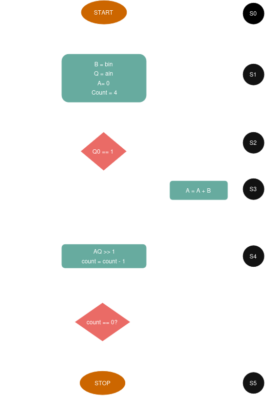
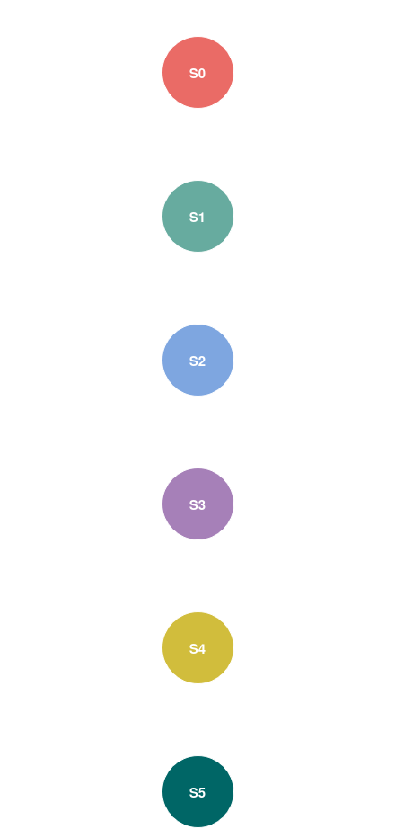
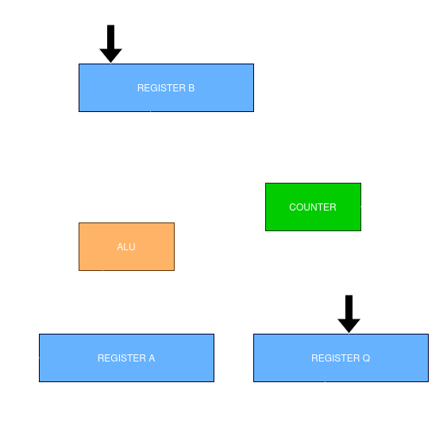
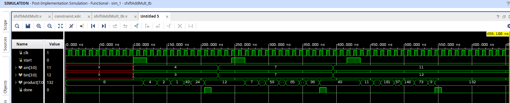
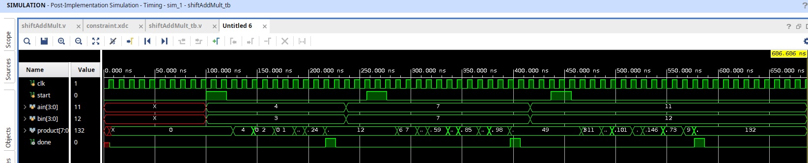

# 4-Bit Sequential Shift-and-Add Multiplier in Verilog

## Overview

This project presents the design and FPGA implementation of a **4-bit Sequential Shift-and-Add Multiplier** using **structural Verilog HDL**. The multiplier computes the product of two 4-bit unsigned binary numbers by repeatedly adding the multiplicand to an accumulator based on the least significant bit (LSB) of the multiplier and performing right-shift operations after each iteration.

The design follows a **Controller–Datapath architecture**, where the controller is implemented as a **Finite State Machine (FSM)** that generates the required control signals, while the datapath consists of registers, an arithmetic logic unit (ALU), and a counter responsible for executing the multiplication algorithm.

The design was first verified through functional simulation and later synthesized, implemented, and tested on a **Xilinx ZedBoard** using the **Xilinx Vivado Design Suite**.

## Project Architecture

The multiplier is divided into two major functional blocks:

- **Controller** – Implements a finite state machine (FSM) that controls the sequence of operations by generating control signals for loading registers, shifting data, performing addition, and terminating the multiplication process.

- **Datapath** – Performs the arithmetic operations using registers, an ALU, and a counter. The datapath executes the operations requested by the controller and stores the intermediate and final multiplication results.

## Shift-and-Add Multiplication Algorithm

The shift-and-add algorithm is a classical sequential multiplication technique that computes the product over multiple clock cycles using an accumulator, registers, and a counter. The implementation presented in this project follows the **shift-and-add multiplication architecture described by R. S. Gaonkar** in *Microprocessor Architecture, Programming, and Applications with the 8085*, adapting the algorithm into a structural Verilog implementation based on a controller–datapath architecture.

Unlike a combinational multiplier, the sequential approach performs one partial operation per clock cycle, resulting in a simpler and more area-efficient hardware implementation.

In this design, the multiplicand is stored in **Register B**, the multiplier in **Register Q**, and the partial product in **Register A**. A 2-bit down counter is initialized to **3**, representing the four iterations required to process all four bits of the multiplier. During each iteration, the least significant bit (`Q₀`) of the multiplier is examined. If `Q₀` is `1`, the multiplicand is added to the accumulator. The combined `AQ` register is then shifted right by one bit, and the counter is decremented. This sequence repeats until the counter reaches zero, after which the final 8-bit product is available in the combined `AQ` register.

The multiplication procedure is summarized below:

1. Load the multiplicand into **Register B**.
2. Load the multiplier into **Register Q**.
3. Clear the accumulator (**Register A**).
4. Initialize the counter to **3**.
5. Examine the least significant bit (`Q₀`) of the multiplier.
6. If `Q₀ = 1`, perform **A ← A + B**.
7. Shift the combined `AQ` register one bit to the right.
8. Decrement the counter.
9. Repeat Steps 5–8 until the counter reaches **0**.
10. The final product is available in the combined **AQ** register.in the combined **AQ** register.

## Algorithm Flowchart

  

<em>Figure 1. Flowchart of the shift-and-add multiplier.</em>

The flowchart illustrates the complete sequence of operations performed during multiplication. After loading the operands and initializing the accumulator and counter, the controller checks the least significant bit (`Q₀`) of the multiplier. Depending on its value, the accumulator is conditionally updated before the combined `AQ` register is shifted right. The process repeats until the counter reaches zero, indicating that all four multiplication cycles have been completed and the final product is ready.

## Finite State Machine (FSM)

The controller is implemented as a **Moore Finite State Machine (FSM)** that coordinates the sequential execution of the shift-and-add multiplication algorithm. It generates the control signals required by the datapath, ensuring that register loading, conditional addition, shifting, and counter updates occur in the correct order.

The final controller consists of **six states**, each dedicated to a specific stage of the multiplication process. By assigning a single responsibility to each state, the controller becomes easier to understand, verify, and maintain. Once the `start` signal is asserted, the FSM initializes the datapath, repeatedly executes the shift-and-add operations for four iterations, and finally enters the completion state where the multiplication result is available.

### Controller FSM

  

<em>Figure 2. Finite State Machine controlling the sequential shift-and-add multiplier.</em>

### State Description

| State | Description |
|:------:|-------------|
| **S0 (Idle)** | Waits for the `start` signal. |
| **S1 (Load)** | Loads the multiplicand and multiplier into their respective registers, clears the accumulator, and initializes the counter to **3**. |
| **S2 (Decide)** | Examines the least significant bit (`Q₀`) of the multiplier to determine whether an addition is required. |
| **S3 (Add)** | Performs the operation **A ← A + B** when `Q₀ = 1`. If `Q₀ = 0`, this state is skipped. |
| **S4 (Shift)** | Shifts the combined `AQ` register one bit to the right, decrements the counter, and determines whether another iteration is required. |
| **S5 (Done)** | Indicates the completion of multiplication. The final 8-bit product is available in the combined `AQ` register. |

### FSM Operation

After the operands are loaded, the controller repeatedly evaluates the least significant bit of the multiplier (`Q₀`). If `Q₀` is `1`, the multiplicand is added to the accumulator before the registers are shifted. Otherwise, the controller proceeds directly to the shift operation. After each shift, the counter is decremented, and the sequence repeats until all four multiplier bits have been processed. When the counter reaches zero, the controller transitions to the **Done** state, signalling the successful completion of the multiplication process.

### Controller Design Refinement

The controller was initially designed as a **5-state FSM** consisting of the **Idle**, **Load**, **Add**, **Shift**, and **Done** states. During functional verification, it was observed that combining the decision-making process with the arithmetic operation increased the complexity of the control logic. Specifically, the controller had to evaluate the least significant bit of the multiplier (`Q₀`) while simultaneously determining whether the addition state should be executed before the shift operation.

To improve the organization of the control logic, the FSM was refined by introducing a dedicated **Decide** state, resulting in the final **6-state controller**. In this revised design, the controller first evaluates the value of `Q₀` and then determines the appropriate next state. If `Q₀ = 1`, it transitions to the **Add** state; otherwise, it proceeds directly to the **Shift** state. After the shift operation, the counter is decremented, and the multiplication sequence repeats until all four iterations have been completed.

This refinement separates the decision-making stage from the arithmetic and shift operations, allowing each state to perform a single well-defined function. As a result, the controller is easier to verify, debug, and maintain while providing improved synchronization between the controller and datapath.

## Datapath Architecture

The datapath is responsible for executing the arithmetic and data movement operations required by the shift-and-add multiplication algorithm. It consists of registers, an arithmetic logic unit (ALU), multiplexers, and a counter, all operating under the control of the finite state machine (FSM). The controller generates the necessary control signals, while the datapath performs the corresponding operations during each clock cycle.

The multiplicand is stored in **Register B**, whereas the multiplier is stored in **Register Q**. The accumulator (**Register A**) holds the intermediate partial products generated during multiplication. Whenever the controller determines that the least significant bit of the multiplier (`Q₀`) is `1`, the ALU adds the contents of Register B to Register A. After the addition (if required), the combined `AQ` register is shifted right by one bit, and the iteration counter is decremented. This process repeats until all four multiplier bits have been processed, after which the combined contents of Registers A and Q form the final 8-bit product.

### Datapath Block Diagram

  

<em>Figure 3. Datapath architecture of the 4-bit sequential shift-and-add multiplier.</em>

## RTL Modules

The multiplier is implemented using a modular structural Verilog design, where each hardware block is realized as an independent module. This modular approach improves readability, simplifies debugging, and allows individual components to be verified independently before integration into the top-level design.

The functionality of each RTL module is summarized below.

| Module | Description |
|---------|-------------|
| **shiftAddMult.v** | Top-level module that integrates the controller and datapath, providing the complete sequential multiplier implementation. |
| **controller.v** | Implements the finite state machine (FSM) responsible for generating the control signals required by the datapath. |
| **datapath.v** | Contains the arithmetic and data movement hardware, including registers, multiplexers, ALU, and counter connections. |
| **alu.v** | Performs the addition operation between the accumulator and multiplicand during multiplication. |
| **counter.v** | Implements a 2-bit down counter initialized to **3**, controlling the four multiplication iterations. |
| **pipo.v** | Parallel-In Parallel-Out (PIPO) register used for storing data during the multiplication process. |
| **shiftregA.v** | Shift register implementing the accumulator (Register A). |
| **shiftregQ.v** | Shift register implementing the multiplier register (Register Q). |
| **shiftreg_top.v** | Wrapper module that coordinates the shifting of Registers A and Q as a combined register. |

### Module Interaction

The `shiftAddMult` module serves as the top-level entity, connecting the controller and datapath. The controller generates control signals such as register load, accumulator clear, shift enable, and counter control, while the datapath executes the corresponding arithmetic and register operations. This separation of control and data processing follows the classical controller–datapath design methodology, resulting in a modular and scalable implementation.

## Functional Simulation

The design was functionally verified using a Verilog testbench. The simulation confirms the correct operation of the controller–datapath architecture, including register initialization, FSM state transitions, conditional addition, right-shift operations, and generation of the final 8-bit product.

### Simulation Waveform

  

<em>Figure 5. Behavioral simulation waveform of the 4-bit sequential shift-and-add multiplier.</em>

  

<em>Figure 6. Post-Synthesis Functional waveform of the 4-bit sequential shift-and-add multiplier.</em>

  

<em>Figure 7. Post-Synthesis Timing waveform of the 4-bit sequential shift-and-add multiplier.</em>

  

<em>Figure 8. Post-implementation Functional waveform of the 4-bit sequential shift-and-add multiplier.</em>

  

<em>Figure 9. Post-implementationTiming waveform of the 4-bit sequential shift-and-add multiplier.</em>

